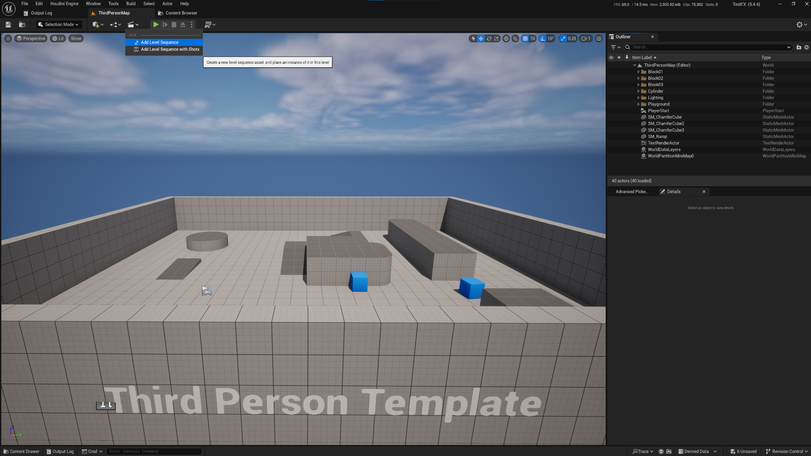

     .----------------.  .----------------.  .----------------. 
    | .--------------. || .--------------. || .--------------. |
    | |  ________    | || |  _________   | || |  ____  ____  | |
    | | |_   ___ `.  | || | |_   ___  |  | || | |_  _||_  _| | |
    | |   | |   `. \ | || |   | |_  \_|  | || |   \ \  / /   | |
    | |   | |    | | | || |   |  _|      | || |    > `' <    | |
    | |  _| |___.' / | || |  _| |_       | || |  _/ /'`\ \_  | |
    | | |________.'  | || | |_____|      | || | |____||____| | |
    | |              | || |              | || |              | |
    | '--------------' || '--------------' || '--------------' |
     '----------------'  '----------------'  '----------------' 

           DarknessFX @ https://dfx.lv | Twitter: @DrkFX

# AdvancedPickerFX - How to Use

- Create a new project using Third Person Template.  
  

- Open the project, then at Toolbar > Level Sequence > Add Level Sequence .  
  

- Save this sequence.  
  

- Content Browser > Characters > Mannequins > Meshes > SKM_Manny , drag-drop SKM_Manny to your level viewport.  
  

- Should look like this.  
  

- At Level Sequence, click + ADD and select SKM_Manny.  
  

- With luck, not only Manny but CR_Mannequin_Body is also added.  
  

- Without luck, you need select SKM_Manny manually and click a + sign, at the right of the table cell. Then Control Rig -> Control Rig Classes and it will show avaiable ControlRigs for this skeleton. 
  

- Back to Content Browser -> Tools Folder -> Right-click AdvancedPickerFX and Run Editor Utility Widget.  
  

- You can now just attach AdvancedPickerFX tab anywhere in the LevelEditor and start using it. 
  
  
**[Return to Main Page](./README.md)**