     .----------------.  .----------------.  .----------------. 
    | .--------------. || .--------------. || .--------------. |
    | |  ________    | || |  _________   | || |  ____  ____  | |
    | | |_   ___ `.  | || | |_   ___  |  | || | |_  _||_  _| | |
    | |   | |   `. \ | || |   | |_  \_|  | || |   \ \  / /   | |
    | |   | |    | | | || |   |  _|      | || |    > `' <    | |
    | |  _| |___.' / | || |  _| |_       | || |  _/ /'`\ \_  | |
    | | |________.'  | || | |_____|      | || | |____||____| | |
    | |              | || |              | || |              | |
    | '--------------' || '--------------' || '--------------' |
     '----------------'  '----------------'  '----------------' 

           DarknessFX @ https://dfx.lv | Twitter: @DrkFX

# AdvancedPickerFX for Unreal Engine 5.4 Character Animation

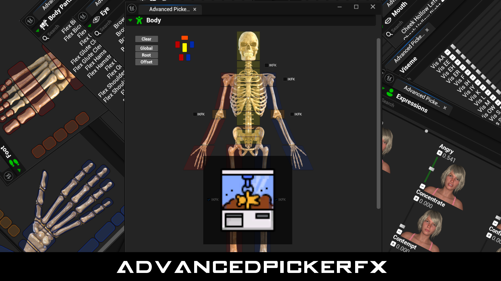  

## About

AdvancedPickerFX is free and open source Editor Utility Tool for Unreal Engine GameDev Community. Created to work with any skeletons (UE4, UE5 Manny+Quinn, Echo, MetaHuman, others) and inpired by Epic's Unreal Engine MetaHuman ControlRig Picker, AdvancedPickerFX provides the expetected main Picker features (bones and control groups shortcuts) and also feature customizable categories to access and edit Expressions and Morph Targets.

## Installation

Simply copy \Tool\ folder from this repository to your Unreal Engine project.

## How to use

If the phrase "Add a controlrig in LevelSequence" don't make sense or if you can not find the tool with the instructions below, then check <a href="./HowToUse.md" target="_blank">How To Use - Basic Steps</a>.

- Create or open a Level Sequence.
- Add a SkeletalMesh actor to Level Sequence.
- Attach a ControlRig to SkeletalMesh.
- Content Browser, right-click AdvancedPickerFX -> Run Editor Utility Widget. After the 1st run, AdvancedPickerFX also register as a menu at LevelEditor Menu > Tools > Editor Utility Widgets > AdvancedPickerFX .
- AdvancedPickerFX tab will show up and sync to your ControlRig and Level Sequence.

## Features

| Screen | Description |
| ------------- | ------------- |
| 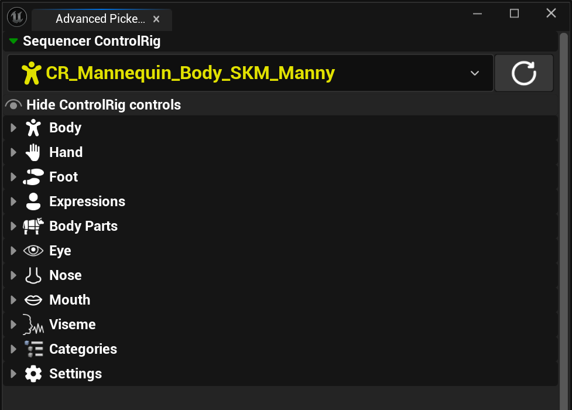   | AdvancedPickerFX main screen, here you can choose what ControlRig in Sequence to sync and work with. If needed the refresh button will search for new ControlRigs. |
| 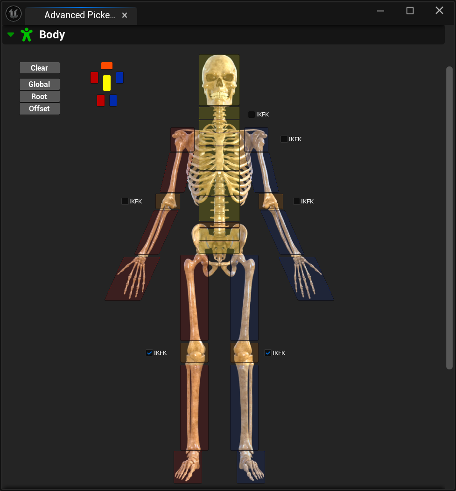   | Collection of shortcuts to main bones controls. |
| 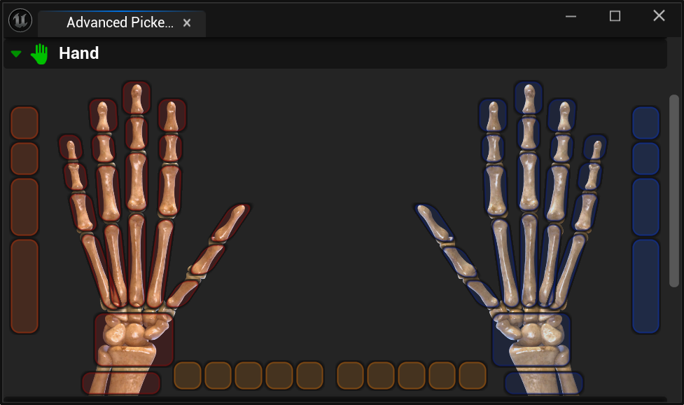   | Collection of shortcuts to hand and fingers controls. |
| 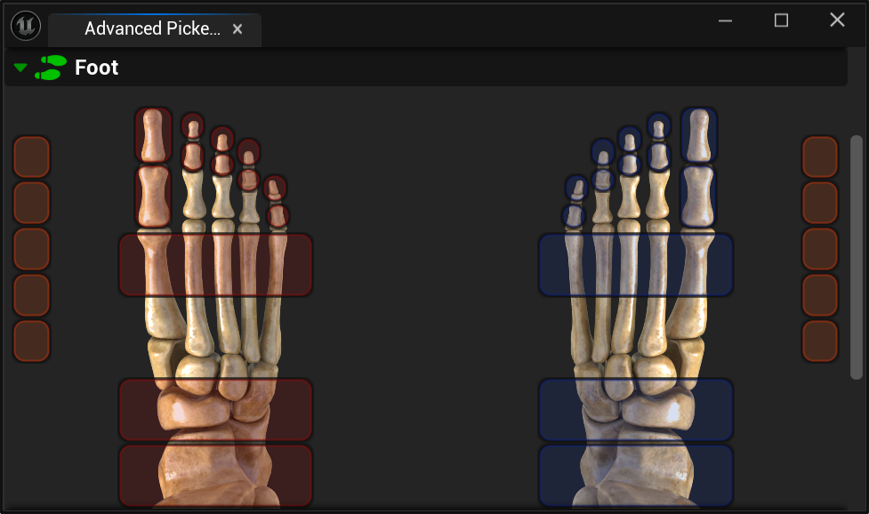   | Collection of shortcuts to foot and toes controls. |
| 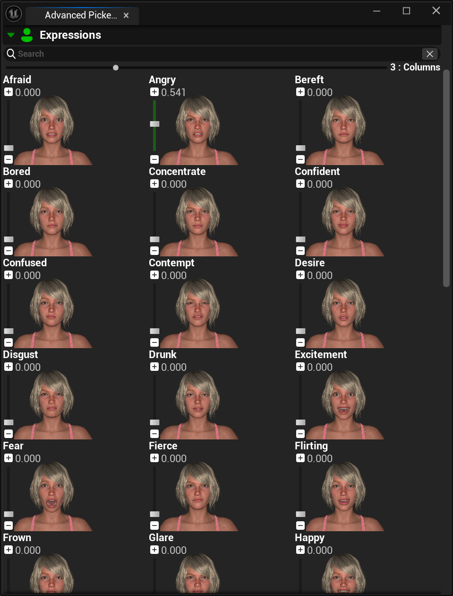   | Collection of shortcuts of available expressions. |
| 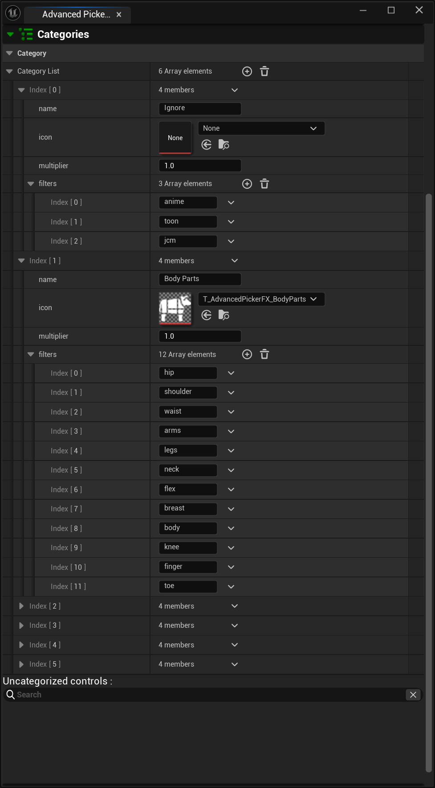   | Categories feature an accessible and expansible list of sub-categories and filters. |
| 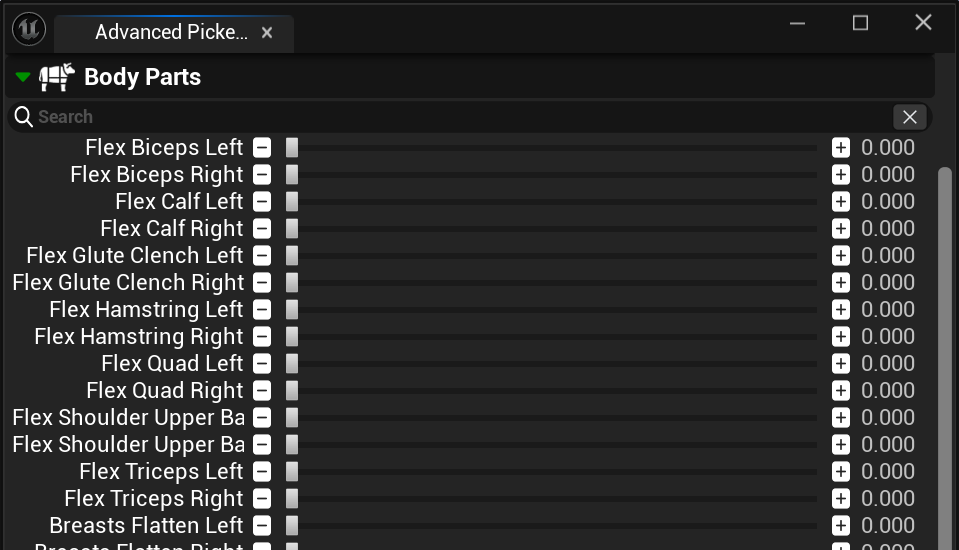   | Pre-configured category grouping Body Morph Target controls. |
| 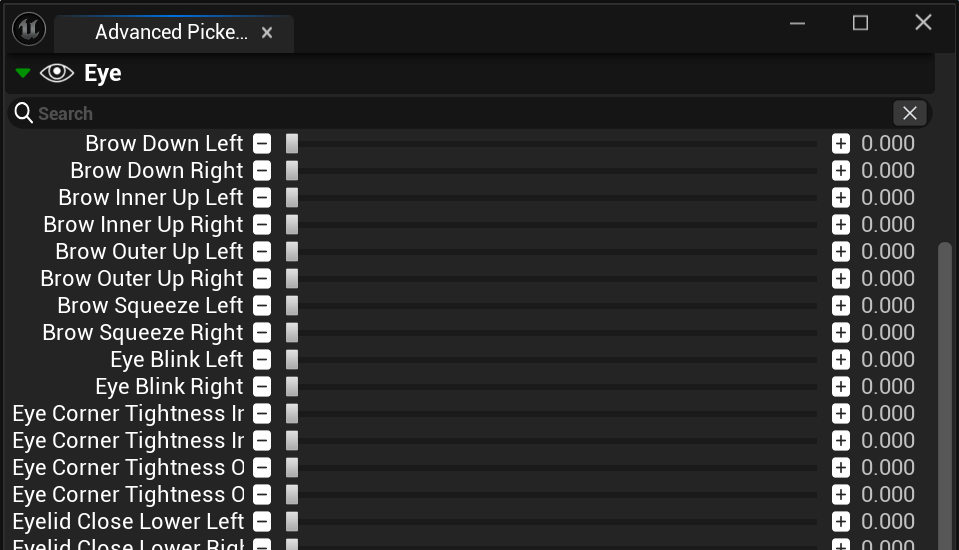   | Pre-configured category grouping Eye Morph Target controls. |
| 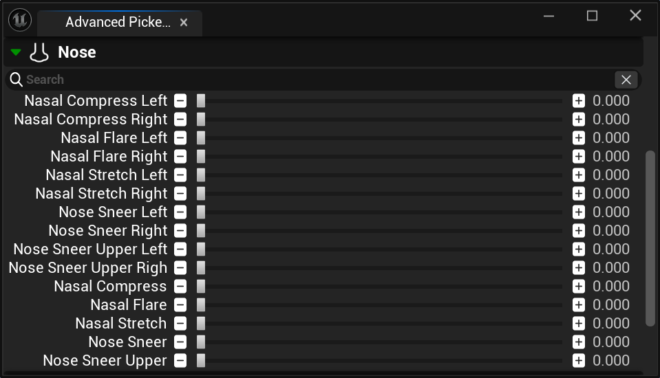   | Pre-configured category grouping Nose Morph Target controls. |
| 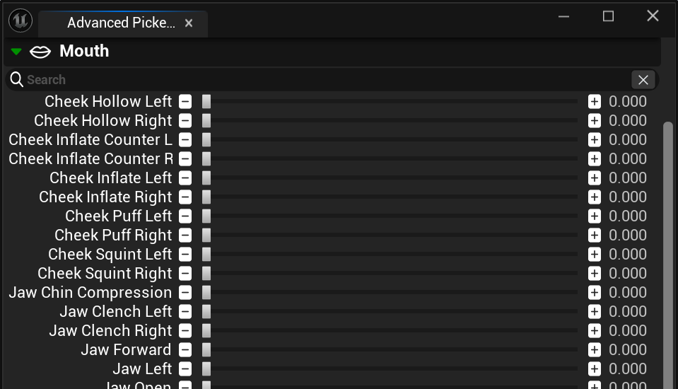   | Pre-configured category grouping Mouth Morph Target controls. |
| 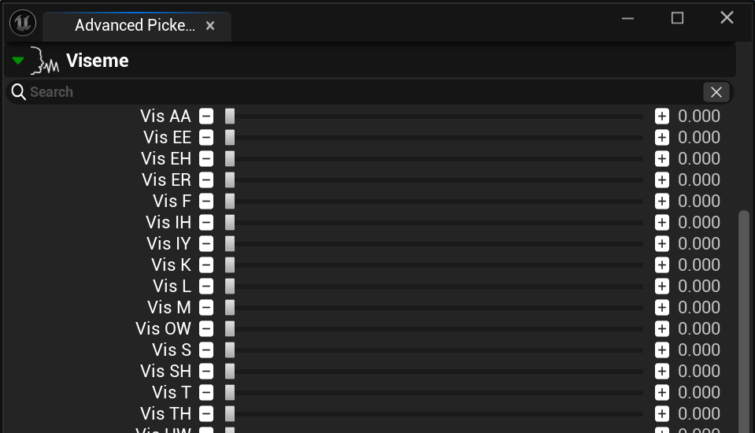   | Pre-configured category grouping Viseme Morph Target controls. |

## Credits

Logo Icon use Clamp icon fom icons8 - https://icons8.com/icon/ju3rmQ3k4Ymh/clamp  
Logo Font use Gamecuben from Bleutuna - https://www.dafont.com/gamecuben.font  

Unreal Engine from Epic Games - https://www.unrealengine.com/  
Unreal Engine MetaHuman ControlRig Picker - https://www.unrealengine.com/metahuman  
Skeleton images use Midnight Bones for Genesis 9 from Daz3D - https://www.daz3d.com/midnight-bones-for-genesis-9  
Expressions images use Genesis 9 Expressions with Victoria 9 model from Daz3D - https://www.daz3d.com/genesis-9-expressions  
Microsoft Fluent Icons - https://github.com/microsoft/fluentui-system-icons  
icons8 - https://icons8.com  
FontAwesome - https://fontawesome.com  
Google Material Design Icons - https://fonts.google.com/icons 

## License

@MIT - Free for everyone and any use.   
DarknessFX @ <a href="https://dfx.lv" target="_blank">https://dfx.lv</a> | Twitter: <a href="https://twitter.com/DrkFX" target="_blank">@DrkFX</a>  https://github.com/DarknessFX/AdvancedPickerFX
